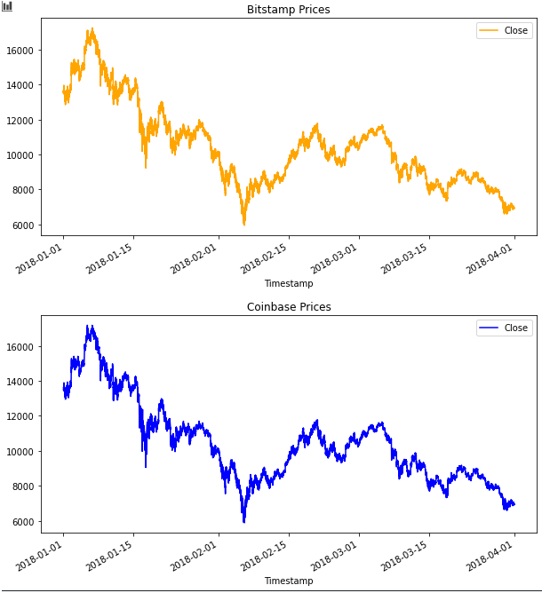
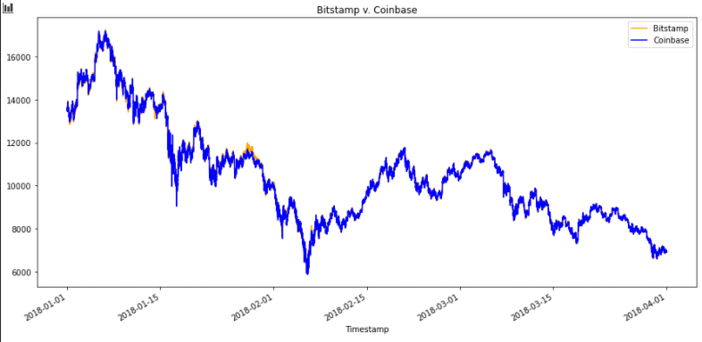
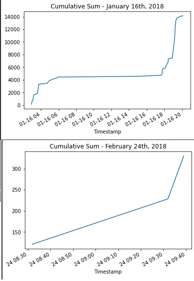

Module 3 - Challenge 3 : Crypto Arbitrage
=========================================

## Purpose

 The purpose of this notebook should seek to demonstrate the inefficiencies between markets, and our ability to capitalize on these inefficiences. 

 Specficially we are seeking to visualize and find discrepancies between the Bitstamp and Coinbase cryptocurrency marketplaces. 

---

## Technologies

Jupyter notebooks and the Pandas data analysis library were used in the creation of this project. 

---

## Installation Guide

First, install the jupyter and pandas libraries. In your terminal or command shell type the following: 

```python
pip install jupyter
```

```python
pip install pandas
```

Additionally, matplotlib was used in the creation of the data visualization. This is included in the imports at the beginning of the jupyter notebook. 

---

## Analysis

In the below image, we take a slice of the Bitstamp and Coinbase markets:


From there, we utilize matplotlib to visualize each of the datasets:



By superimposing both graphs we can really start to visualize areas of opportunity:



Later in the analysis we will be digging into the specific areas of opportunity of the above dataset, but visually one can see that the best areas of opportunity are clearly in the months of January and February. 

---

After breaking the data down further, we can determine the profit to be gained specifically on the days of January 16th and February 24th:



Profit margins for these days are $14147.17, and $330.07, respectively. 

The dataset from March was intentionally omitted as there was no profit to be made in that time period. 

---

## Conclusion

Arbitrage opportunities avail themselves rarely, and in this specific slice of data, we can clearly see how fleeting these opportunities can be. 

---

## Contributors

Created by: Chris Henderson

cdhendy@gmail.com

[LinkedIn](https://www.linkedin.com/in/chris-henderson123/)

---

## License

(c) Copyright 2021 Chris Henderson

Licensed under the MIT license:

    http://www.opensource.org/licenses/mit-license.php

Permission is hereby granted, free of charge, to any person obtaining a copy
of this software and associated documentation files (the "Software"), to deal
in the Software without restriction, including without limitation the rights
to use, copy, modify, merge, publish, distribute, sublicense, and/or sell
copies of the Software, and to permit persons to whom the Software is
furnished to do so, subject to the following conditions:

The above copyright notice and this permission notice shall be included in
all copies or substantial portions of the Software.

THE SOFTWARE IS PROVIDED "AS IS", WITHOUT WARRANTY OF ANY KIND, EXPRESS OR
IMPLIED, INCLUDING BUT NOT LIMITED TO THE WARRANTIES OF MERCHANTABILITY,
FITNESS FOR A PARTICULAR PURPOSE AND NONINFRINGEMENT. IN NO EVENT SHALL THE
AUTHORS OR COPYRIGHT HOLDERS BE LIABLE FOR ANY CLAIM, DAMAGES OR OTHER
LIABILITY, WHETHER IN AN ACTION OF CONTRACT, TORT OR OTHERWISE, ARISING FROM,
OUT OF OR IN CONNECTION WITH THE SOFTWARE OR THE USE OR OTHER DEALINGS IN
THE SOFTWARE.
